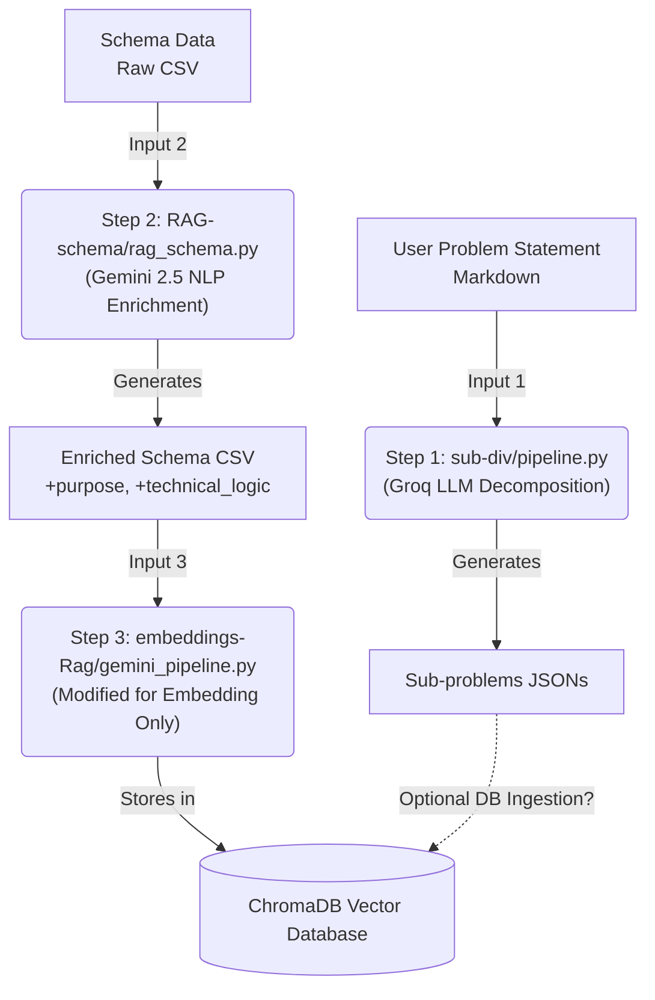

# Automate Master Pipeline Integration

This implementation plan outlines the proposed approach to combine the three independent pipelines (`sub-div`, `RAG-schema`, and `embeddings-Rag`) into a single, automated master pipeline while retaining the existing folder structure.

## Master Pipeline Architecture Flow

## User Review Required

> [!IMPORTANT]
> The current `gemini_pipeline.py` inside `embeddings-Rag` actually performs **both** Step 2 (adding the 2 NLP columns via Gemini) and Step 3 (converting to embeddings). 
> 
> My proposed plan involves modifying `gemini_pipeline.py` to **remove** the redundant NLP generation step so that it just reads the enriched CSV generated by the `RAG-schema` step. This will save significant time and API costs, avoiding duplicating the work of Step 2.

> [!NOTE]
> The master pipeline will be a new Python script (`master_pipeline.py`) located at the root directory (`d:\RAG\`). It will call each of the three steps sequentially, passing the required inputs and outputs between them.

## Open Questions

> [!WARNING]
> 1. **Step 1 vs Step 2/3 Connection:** Step 1 processes a markdown "problem statement" into sub-problem JSON files. Steps 2 and 3 process a "schema CSV" into an enriched CSV and then into embeddings. Does the master pipeline need to embed the JSON sub-problems from Step 1 into the same ChromaDB vector database as the schema, or are they kept separate?
> 2. **Input arguments:** Should the master pipeline accept paths to the `problem_statement.md` and `schema.csv` as command-line arguments, or should it automatically discover them from a specific "input" folder?
> 3. **Environment Variables:** Currently, each folder has its own `.env` file (some with Groq API keys, some with Gemini). I will ensure the master pipeline loads the necessary keys or centralize them into a single `.env` at the root. Is a centralized `.env` file at `d:\RAG\.env` preferred?

## Proposed Changes

---

### Master Pipeline Orchestrator

This script will serve as the single entry point.

#### [NEW] [master_pipeline.py](file:///d:/RAG/master_pipeline.py)
- Create a new Python script that orchestrates the workflow using Python's `subprocess` or by importing the modules directly.
- **Workflow:**
  1. Accepts arguments for the input markdown file and the input CSV file.
  2. Runs `sub-div/pipeline.py` on the input markdown.
  3. Runs `RAG-schema/rag_schema.py` on the input CSV to produce an `enriched_schema.csv`.
  4. Runs `embeddings-Rag/gemini_pipeline.py` on the `enriched_schema.csv` to produce the final ChromaDB embeddings.

---

### Refactoring Embeddings Pipeline

Removing duplicate work to streamline the process.

#### [MODIFY] [gemini_pipeline.py](file:///d:/RAG/embeddings-Rag/gemini_pipeline.py)
- Remove the `generate_nl_descriptions` function and the time.sleep associated with it.
- Modify the script to read the `purpose` and `technical_logic` directly from the input CSV (since `rag_schema.py` will have already added these columns).
- Add support for accepting an enriched CSV file as an argument and ingesting it seamlessly.

---

### Centralizing Environment Configurations (Optional but Recommended)

#### [NEW] [.env](file:///d:/RAG/.env)
- Combine `GROQ_API_KEY` and `GEMINI_API_KEY` into a single configuration file at the root.

## Verification Plan

### Automated Tests
- Run the `master_pipeline.py` using sample files (e.g., `sample.md` from `sub-div` and a schema CSV from `RAG-schema`).
- Verify that the intermediate JSON files and the enriched CSV file are generated correctly.
- Verify that the ChromaDB instance in `embeddings-Rag/chroma_gemini_db` is updated and contains the correct vector embeddings.

### Manual Verification
- Review the logs of the master pipeline to ensure no rate-limiting errors occur.
- Check the output of ChromaDB to ensure embeddings capture the correct NLP descriptions generated in Step 2.
